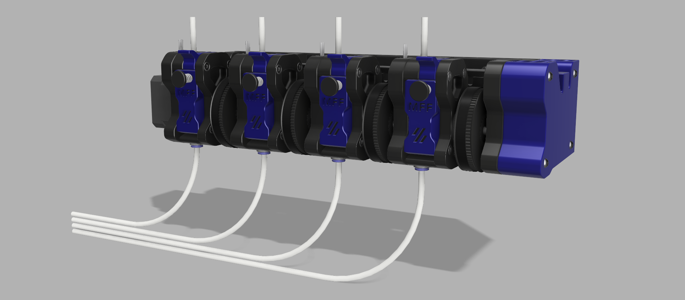

# MFF – Mini Four Feeder

**MFF (Mini Four Feeder)**  
Compact Multi Material System for Klipper

---

**Announcement Repository – Work in Progress**

The **MFF (Mini Four Feeder)** is an upcoming compact multi-material
filament system **based on the Voron M4 extruder design**.

This repository currently serves as a **public information and announcement
page only**.  
No design files, firmware or configuration files are published here at this time.

---

## 🔹 Project Overview

MFF is designed as a compact and modular multi-material solution with a strong
focus on reliability, serviceability and Klipper integration.

### Key concepts:
- Based on the **Voron M4 extruder**
- 4 filament lines in a single linear assembly
- One shared drive motor
- Electronic clutch selection per filament line
- Designed for **Klipper** and **Happy Hare**
- Optimized for Voron and custom printer builds

---

## 🔹 Project Status

**Active development**

- Development is ongoing in a **private repository**
- Mechanical design, electronics and firmware are under active iteration
- Public release will follow once a stable milestone is reached

---

## 🔹 Licensing & Attribution

This project is **based on and inspired by the Voron M4 extruder**, which is
licensed under the **GNU General Public License v3.0 (GPL-3.0)**.

At this stage:
- No source files or design files are distributed
- No license has yet been applied to released files
- Licensing details will be clearly provided upon public release

Voron Design is **not affiliated** with this project.

---

## 🔹 Planned Scope (Public Release)

- Mechanical design (printed + off-the-shelf components)
- Custom PCB(s) for clutch control and filament sensing
- Klipper configuration and macros
- Happy Hare integration
- Assembly documentation and user guides

---

## 🔹 Collaboration & Early Access

Development currently takes place in a **private repository**.

Early access may be granted to:
- Firmware contributors
- Hardware reviewers

Access is **by invitation only**.

---

## 🔹 Media

Renders, development photos and short demo clips will be added
to this repository when available.

---

© Scops Owl Designs  
Project information page — no files released.

## 🔹 Voron Attribution & Disclaimer

This project is **not an official Voron Design project**.

MFF is an independent community project that builds upon the
**Voron M4 extruder design**, which is released under the
**GNU General Public License v3.0 (GPL-3.0)**.

The Voron Team and contributors are gratefully acknowledged for their
work and for making their designs available to the community.
