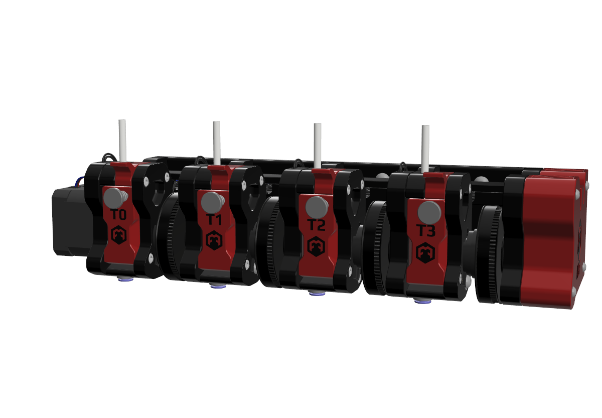

# MFF – Mini Four Feeder

**MFF (Mini Four Feeder)**  
Compact Multi Material System for Klipper

**Announcement Repository – Closed Beta Phase**

The **MFF (Mini Four Feeder)** is an upcoming compact multi-material
filament system **based on the Voron M4 extruder design**.

This repository currently serves as a **public information and announcement
page only**.  
No design files, firmware or configuration files are published here at this time.

---

## 🔹 Project Overview

### MFF is designed as a compact and modular multi-material solution with a strong focus on:
- Reliability
- Serviceability
- Tight Klipper integration

### Key concepts:
- Based on the **Voron M4 extruder**
- 4 filament lines in a single linear assembly
- One shared drive motor
- Electronic clutch selection per filament line
- Designed for **Klipper** and **Happy Hare**
- Optimized for Voron and custom printer builds

---

## 🔹 Project Status

**Closed Beta Preparation**
- Mechanical design: feature complete, refinement ongoing
- Electronics: prototype hardware validated
- Firmware & macros: functional and under active testing

The project is now entering a closed beta testing phase.

Development continues in private repositories while feedback from selected testers is collected.

---

## 🔹 Closed Beta Test

The closed beta is intended to validate:
- Mechanical reliability
- Clutch behavior and wear
- Firmware logic and macros
- Installation flow and documentation clarity

### Who can apply?
We are looking for experienced users who:
- Are familiar with Klipper-based printers
- Have experience with Voron or custom builds
- Are comfortable testing early hardware and firmware
- Are willing to provide structured feedback

Beta access is limited and by invitation only.

---

## 🔹 Join the MFF Discord Community

All project discussion, updates, and beta coordination take place on our Discord server.

### Join the MFF Discord:
https://discord.com/invite/hrm4CcE5az

On Discord you can:
- Follow development progress
- See preview renders and test results
- Apply for closed beta participation
- Ask questions and discuss design choices

---
## 🔹 Licensing & Attribution

This project is **based on and inspired by the Voron M4 extruder**, which is
licensed under the **GNU General Public License v3.0 (GPL-3.0)**.

At this stage:
- No source files or design files are distributed
- No license has yet been applied to released files
- Licensing details will be clearly provided upon public release

Voron Design is **not affiliated** with this project.

---

## 🔹 Planned Scope (Public Release)

- Mechanical design (printed + off-the-shelf components)
- Custom PCB(s) for clutch control and filament sensing
- Klipper configuration and macros
- Happy Hare integration
- Assembly documentation and user guides

---

## 🔹 Support development  
Most of my work is open-source.  
If it helped you, consider buying me a coffee.

https://ko-fi.com/mff_team

---

## 🔹 Voron Attribution & Disclaimer

This project is **not an official Voron Design project**.

MFF is an independent community project that builds upon the
**Voron M4 extruder design**, which is released under the
**GNU General Public License v3.0 (GPL-3.0)**.

The Voron Team and contributors are gratefully acknowledged for their
work and for making their designs available to the community.

---

© MFF Team  
Project information page — no files released.
